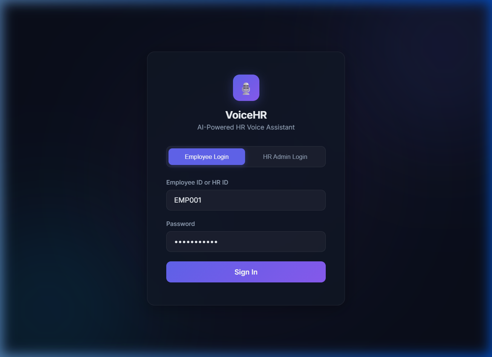
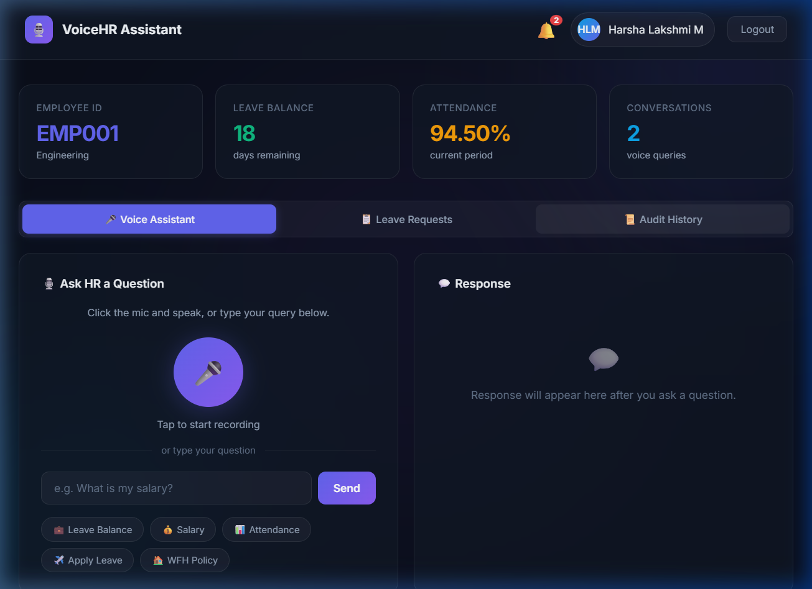
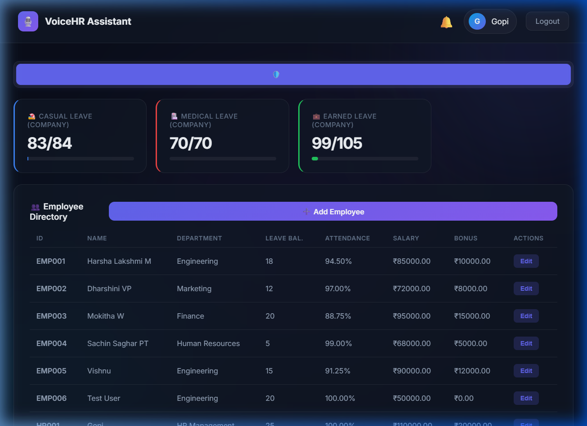

# 🎙️ VoiceHR – AI-Powered HR Voice Assistant

A voice-enabled HR management system built with **Django REST Framework**. Employees interact with HR services using **voice commands** or **text queries** — ask about leave balance, salary, company policies, and more. HR managers get a full portal to manage employees and approve leave requests.

---

## ✨ Features

- 🎤 **Voice Assistant** – Speak to query HR info (browser Web Speech API – free, no key needed)
- 💬 **Text Query** – Type questions as an alternative to voice
- 🔊 **Text-to-Speech** – AI reads back responses using gTTS
- 📋 **Leave Management** – Apply for leave, view balance, track requests
- 🛡️ **HR Portal** – Manage employees, approve/reject leaves
- 📜 **Audit Logs** – Full conversation history
- 🔔 **Notifications** – Real-time alerts for leave requests
- 🔐 **Token Authentication** – Secure login for employees & HR

---

## 🛠️ Tech Stack

| Layer      | Technology                        |
|------------|-----------------------------------|
| Backend    | Django 4.2, Django REST Framework |
| Database   | PostgreSQL                        |
| Voice STT  | Web Speech API (browser-built-in) |
| Voice TTS  | gTTS (Google Text-to-Speech)      |
| NLP        | Regex-based Intent Recognition    |
| Frontend   | HTML, CSS, JavaScript (SPA)       |

---

## 🚀 How to Run

### Prerequisites
- Python 3.10+
- PostgreSQL installed & running
- Git

### Step 1: Clone the Repository
```bash
git clone <your-repo-url>
cd voicehr
```

### Step 2: Create & Activate Virtual Environment
```bash
cd backend
python -m venv venv

# Windows
venv\Scripts\activate

# macOS/Linux
source venv/bin/activate
```

### Step 3: Install Dependencies
```bash
pip install -r requirements.txt
```

### Step 4: Configure Environment Variables
```bash
cp .env.example .env
```
Open `.env` and set your values:
```env
SECRET_KEY=your-random-secret-key
DB_PASSWORD=your-postgres-password
OPENAI_API_KEY=sk-your-openai-api-key-here   # optional
```

### 🔑 Note – Place Your API Key
> **OPENAI_API_KEY** is **optional**. The app uses the browser's free **Web Speech API** for voice recognition.
> If you want server-side Whisper transcription, get a key from [platform.openai.com/api-keys](https://platform.openai.com/api-keys) and paste it in `.env`.

### Step 5: Setup Database
```bash
psql -U postgres -c "CREATE DATABASE voicehr_db;"
python manage.py makemigrations
python manage.py migrate
```

### Step 6: Create Superuser (HR Admin)
```bash
python manage.py createsuperuser
```

### Step 7: Run the Server
```bash
python manage.py runserver
```

---

## 🌐 URL

After running the server, open in browser:
```
http://127.0.0.1:8000
```

---

## 📸 Output Screenshots

### Login Page


### Employee Dashboard – Voice Assistant


### HR Portal – Employee Directory & Leave Management


---

## 📁 Project Structure
```
voicehr/
├── backend/
│   ├── apps/
│   │   ├── authentication/    # User models, login, token auth
│   │   ├── employees/         # Employee data management
│   │   ├── hr_queries/        # Voice/text query processing
│   │   ├── voice_ai/          # Voice AI endpoints
│   │   ├── nlp_engine/        # NLP intent detection
│   │   └── audit_logs/        # Query history tracking
│   ├── core/                  # Django settings, URLs
│   ├── services/              # Business logic
│   │   ├── hr_service.py      # HR query handler
│   │   ├── intent_service.py  # Intent classification
│   │   ├── whisper_service.py # Speech-to-text
│   │   └── tts_service.py     # Text-to-speech
│   ├── templates/
│   │   └── index.html         # Single-page frontend
│   ├── .env.example           # Environment template
│   ├── manage.py
│   └── requirements.txt
├── screenshots/               # Output screenshots
├── .gitignore
└── README.md
```

---

## 📄 Requirements

See [requirements.txt](backend/requirements.txt):
- Django >= 4.2
- djangorestframework >= 3.14
- psycopg2-binary >= 2.9
- openai >= 1.0 (optional)
- gTTS >= 2.3
- python-dotenv >= 1.0

---

## 📝 License

This project is for educational purposes.
